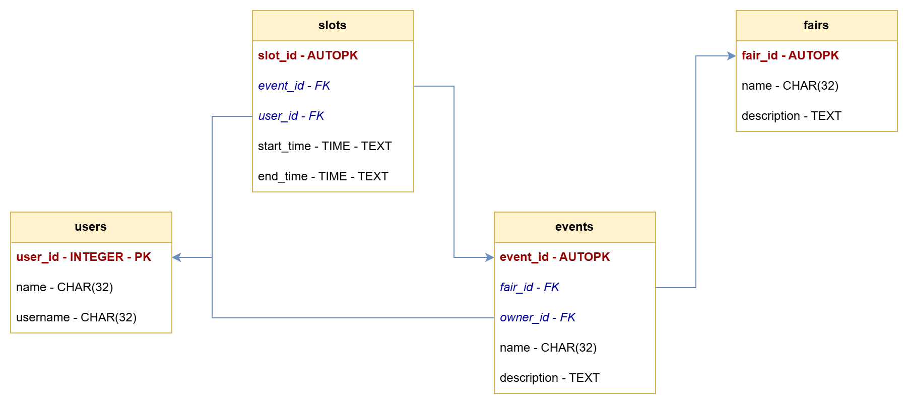

# UniTN Booking Bot Command Cheatsheet

## Table of Contents

1. [Quick start](#quick-start)
2. [Database structure](#database-structure)
3. [Telegram Bot commands](#telegram-bot-commands)
4. [Code commands](#code-commands)

## Quick start

This file presents a summary of the command usages and the database structure. Other resources you can read include:

- The repository `README.md`, concerning the installation and run of the project on a local machine.
- The full project documentation, rooted in `docs/index.html` and accessible at [https://alphanightlight.github.io/UnitnBookingBot/](https://alphanightlight.github.io/UnitnBookingBot/).
- Links to the official documentations of all the API used by this project, reported in the file `info/api_reference.txt`.
- The project report, `report/`, with a full description of the system architecture.

## Database structure

The following picture presents the database structure:

- `users`: Collects information about the user.
  - `user_id`: integer primary key, identifier of the chat between the user and the Bot.
  - `name`: 32-char string, full name associate to the user.
  - `username`: 32-char string, Telegram username (the one starting with @) associate to the user.

- `fairs`: Identify groups of events that are related to each other.
  - `fair_id`: auto-incremental primary key.
  - `name`: 32-char string, the fair name in short.
  - `description`: long string, additional information regarding the fair.

- `events`: Collects information about the event. Events are **not** what will be booked by the user. Users will have to book a time slot that refers to an event instead.
  - `event_id`: auto-incremental primary key.
  - `fair_id`: foreign key referencing `fairs`, the fair associated to the event.
  - `owner_id`: foreign key referencing `users`, the user that published the event.
  - `name`: 32-char string, the event name in short.
  - `description`: long string, additional information regarding the event.

- `slots`: Each event has multiple time slots associate to it. Each of them can be booked by a single user or "Free", i.e. available for booking.
  - `slot_id`: auto-incremental primary key.
  - `event_id`: foreign key referencing `events`, the event this slot refers to.
  - `user_id`: foreign key referencing `users`, the user that booked the slot. If `NULL` the slot is said to be "Free".
  - `start_time`: time string ISO-8601, the starting time of the slot.
  - `end_time`: time string ISO-8601, the ending time of the slot.

## Telegram Bot commands

This section presents all the commands usable by the Telegram Bot, divided in four categories.

- Default commands, present in any Telegram Bot.
  - `/start`: special command automatically issued at the Bot's start. It logs some generic information about the Bot and its purpose.
  - `/help`: presents a brief description of all the other commands.

- Commands to print records. They print information about the database without modifying it.
  - `/fairs`: logs information about a selected fair record.
  - `/events`: logs information about a selected event record.
  - `/whoami`: logs information about the user record associated to the current chat.

- Commands to update and monitor a slot record. They are supposed to be used by the students, who want to book register themself to an event slot.
  - `/book`: updates the `user_id` field of a selected slot record to be the identifier of the current chat. It also inserts a new user record if the current chat is not in the database yet.
  - `/unbook`: updates the `user_id` field of a selected slot record to be `NULL`.
  - `/mybookings`: logs information about all the slots whose `user_id` is the current chat.

- Commands to manage event records and the associated slot records. They are supposed to be used by the companies, who want to publish events the students can register to.
  - `/publish`: inserts a new event record whose `owner_id` is the current chat. It also inserts a new user record if the current chat is not in the database yet.
  - `/changedes`: updates the `description` field of a selected event.
  - `/newslot`: inserts a new slot record referring to a selected event. Its `user_id` will be `NULL`.
  - `/deleteslot`: deletes a selected slot record.
  - `/deleteevent`: deletes a selected event record, as well as all the slot records whose `event_id` refers to it.
  - `/myevents`: the user selects an event whose `owner_id` is the current chat. Then, information about that event record and all the slot record associated to it are logged.

**NOTE**: Bot commands do **not** allow to create fair records, delete fair records or delete user records. Please use the [code commands](#code-commands) if you wish to perform any of these operations.

## Code commands

This section presents the functions usable by the `edit_dp.py` script to directly modify the database via code. All of them require the `db` parameter, the path to the database file.

- Functions to inspect the values in the database
  - `print_users_by_id(db)`: prints all user records on standard output, ordered by identifier.
  - `print_users_by_name(db)`:  prints all user records on standard output, ordered by name.
  - `print_fairs(db,description)`: prints all fair records on standard output, ordered by name. The second parameter hides the `description` field if False.
  - `print_events(db,description)`: prints all event records on standard output. The second parameter hides the `description` field if False.
  - `print_events_with_fair(db)`: prints all event records joined with fairs on standard output.
  - `print_events_with_owner(db)`: prints all event records joined with users on standard output.
  - `print_event_slots(db,event_id)`: prints all the slots of a given event on standard output.

- Functions to insert new values in the database
  - `insert_user(db,user_id,name,username)`: inserts a new user record.
  - `insert_fair(db,name,description)`: inserts a new fair record.
  - `insert_event(db,fair_id,owner_id,name,description)`: inserts a new event record.
  - `create_slot(db,event_id,start_time,end_time)`: inserts a new slot record, `user_id` is set to `NULL`.
  - `assign_slot(db,slot_id,user_id)`: updates the `user_id` field the selected slot.

- Functions to modify the values in the database
  - `update_user(db,user_id,name,username)`: updates a user record.
  - `update_fair(db,fair_id,name,description)`: updates a fair record.
  - `update_event(db,event_id,fair_id,owner_id,name,description)`: updates an event record
  - `update_event_description(db,event_id,description)`: updates just the `description` field of an event record.
  - `update_slot(db,slot_idevent_id,user_id,start_time,end_time)`: updates a slot record.

- Functions to delete values from the database
  - `delete_user(db,user_id)`: deletes a user record.
  - `delete_fair(db,fair_id)`: deletes a fair record.
  - `delete_event(db,event_id,delete_slots)`: deletes an event record. The second parameter allows to delete also all the slot records associated to it if True.
  - `delete_slot(db,slot_id)`: deletes a slot record.
